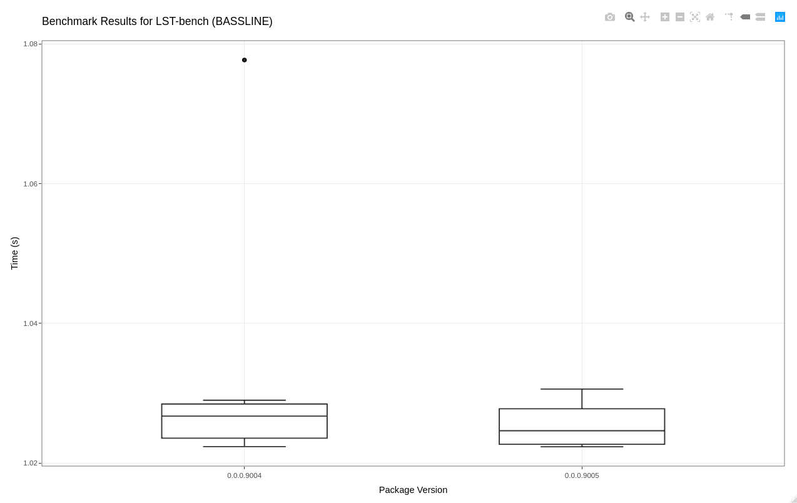

<!-- README.md is generated from README.Rmd. Please edit that file -->

# BenchJournal 

<!-- badges: start -->

[](https://github.com/nathansam/BenchJournal/actions)
[](https://codecov.io/gh/nathansam/BenchJournal?branch=master)
[](https://cran.r-project.org/package=BASSLINE)
[](https://github.com/nathansam/BenchJournal/)
[](https://opensource.org/licenses/GPL-3.0)
<!-- badges: end -->

BenchJournal is a lightweight tool to keep track of benchmarks for a
package as it is being developed. Running benchmarks automatically or
manually is supported.

## Installation

You can install the development version of BenchJournal with:

``` r
# install.packages("devtools")
devtools::install_github("nathansam/BenchJournal")
```

## Using BenchJournal

### Intial setup

BenchJournal supports two workflows.

1.  Automatic: benchmarks will be ran whenever code is pushed to a git
    repository. commit hashes will be used to tag the version of code.
2.  Manual: Benchmarks will be run when the user runs
    `BenchJournal::NewEntry()`. The version of the package, as listed in
    the DESCRIPTION file, will be used to tag the version of the code.

BenchJournal can be set up using a simple function which will create the
folders and files needed to journal your package’s progress in
`/man/BenchJournal/`. These folders/ files will be added to your
`.Rbuildignore`. When this function is ran, the user will interactively
be asked if they wish to use the automatic or manual workflow.

``` r
BenchJournal::Init()
```

Inside `/man/BenchJournal/`, you will now find a folder `scripts`. Save
any R scripts to this directory which you wish to benchmark (I.E. a
script which uses the functions in your package which you are intending
to improve the performance of).

### Adding entries to your journal

If you are using the automatic workflow then simply push commits to
benchmark your scripts.

If you are using the manual workflow then run `NewEntry()` for the first
time. After you have updated your code, update the version of your
package, and re-run `NewEntry` to add the updated results to your
journal.

``` r
BenchJournal::NewEntry()
```

### Plotting your results

An interactive boxplot of your benchmark results using `ggplot` and
`plotly` can be generated:

``` r
BenchJournal::JournalBoxPlot()
```


